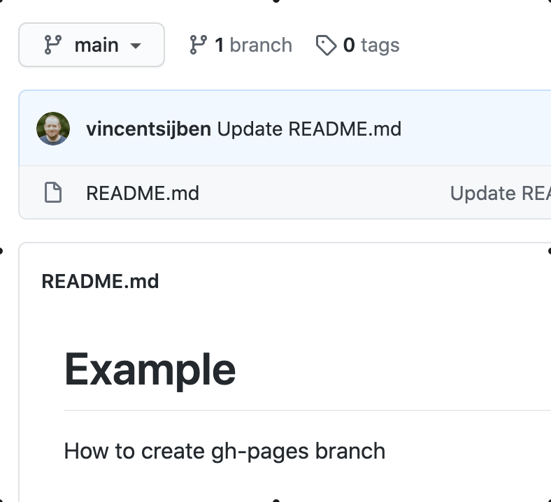

# Assignment Portfolio

*PLEASE READ THIS **ENTIRE** DOCUMENT FIRST*

* [the assignment](#the-assignment)
* [submitting-your-work](#submitting-your-work)


## The assignment


Download this repo and have a look at the ```assignments/portfolio.xd``` file.

* Make sure you recreate the layout from the Adobe XD file as good as possible. There are some fonts included in the assignment folder!
* There are some lorem ipsum text parts and image placeholders. Replace these with your own text and images. 
* Add your profile picture and write something about yourself ánd about CMD.
* Be sure to use images of your previous (CMD) work and show off your skills in this portfolio webpage.
* The XD file also shows the use of a :hover element to be able to annotate your images.
* Use **flexbox** for the thumbnail grid.

Make sure that this edited website works on your local machine. 

## Submitting your work
Inside this assignment repo, create a new branch called **gh-pages** and upload your local work into this branch, **not** in the main branch:



By creating this **gh-pages** branch, you'll automatically publish your work to ```https://<organisation>.github.io/<assignment>-<user>/```. For example: ```https://mia-mmt1-2021.github.io/validating-html-bond007/```.

To 'submit' your work, click the **new pull request** button in the Pull requests tab (next to the Code and Issues tab). 
  * Choose **base:main** and **compare:gh-pages** and click the **Create pull request** button.
  * Select your reviewer (eg. **vincentsijben** or **willmuijrers**) in the sidepanel on the right (only select 1)
  * Make sure to put the published GitHub Pages URL in the comment section and check if it works before actually creating the Pull Request!
  * Do **not** merge this Pull Request yourself. That's up to the reviewer to decide (merging is approving the assignment).
  
  
